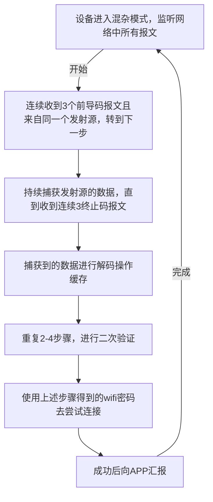

# Arduino

---

- 参考文献：
  1. [ESP32](https://docs.espressif.com/projects/esp-dev-kits/zh_CN/latest/esp32s3/esp32-s3-devkitc-1/user_guide.html#id1)
  2. [Arduino API](https://docs.espressif.com/projects/esp-idf/zh_CN/latest/esp32s3/api-guides/index.html)
  3. [PWM](https://blog.csdn.net/as480133937/article/details/103439546)
  4. [pio io monitor ini 文件配置参数](https://docs.platformio.org/en/latest/projectconf/sections/env/options/monitor/index.html)
  5. [U8G2 库视频介绍](https://www.bilibili.com/video/BV1RM4y1a7J5?spm_id_from=333.788.videopod.episodes&vd_source=b47817c1aa0db593f452034d53d4273a&p=20)
  6. [板载 RGB 驱动](https://www.bilibili.com/video/BV1bU4y1u7WG/?spm_id_from=333.337.search-card.all.click&vd_source=b47817c1aa0db593f452034d53d4273a)
  7. [ILI9488 驱动 TFT 触摸屏](http://www.lcdwiki.com/zh/3.5inch_SPI_Module_ILI9488_SKU:MSP3520)
  8. [LittleFS](https://www.youtube.com/watch?v=V9-cgXag4Ko)

<br>

## 1. 基础配置

---

### 1. 配置 `platformIO`

> Espressif ESP32-S3-DevKitC-1-N8 (8 MB QD, NO PSRAM)


> 或者命令行直接创建这个针对 esp32-n16r8

```shell
platformio project init \
  --board esp32-s3-devkitc-1 \
  --project-option="framework=arduino" \
  --project-option="board_upload.flash_size=16MB" \
  --project-option="board_build.esp32_psram=enabled" \
  --project-option="board_build.esp32_psram_size=8MB"
```


### 2. 引脚配置


### 3. 上拉和下拉

> 所谓的上下拉，就是改变当前 GPIO 的状态是高还是低
>
> 假定我们的 GPIO 默认为高电平，那么想要把他拉下来，那么他就应该是用地，然后导通之后，就会给引脚一个低电平


### 4. pio 自带的串口助手

> pio 自带的串口模拟器，是一个 `uart` 模拟器，我们可以下面命令打开

```bash
pio device monitor
```

> 但是由于 UART 的配置需求，我们如果用命令的话，可能每一次启动都需要敲非常的长。
>
> 就会很麻烦，所以我们可以把波特率，校验位等之类的配置，放到 `platformio.ini` 文件中，有些参数默认的就可以，我们这里就给出常用的几个

```ini
; Serial Monitor 的 Baud Rate
monitor_speed = 9600
; 显示时间戳（这个不是特别详细，如果需要更多内容，可以自己配置输出）
monitor_filters = time, default, colorize
```

### 5. pio 下载第三方库

> 找到对应的库


> 进入库中, 然后配置 ini 文件, 下载第三方库


> 下载结束后, 文件就在这个目录下


### 6. 高位先行

> **高位先行**：在发送数据时，首先发送数据的 **最高有效位（MSB）**，然后是 **最低有效位（LSB）**。
>
> 接收方接收到的数据也会是 **高位先行** 的顺序。

- 发送数据

```rust
R -> 00000000
G -> 00000000
B -> 11111111
```

- 接收端拿到的数据, 一样的

```rust
R -> 00000000
G -> 00000000
B -> 11111111
```

### 7. 推挽模式 & 开漏模式

**推挽模式（Push-Pull）**：GPIO 输出低电平时拉低引脚，输出高电平时直接输出高电平。

> 推挽输出模式就是引脚具有驱动高低电平的能力, 那么 `GPIO_PIN_SET` 是点亮还是熄灭？
>
> 这取决于 LED 的连接方式。如果 LED 是直接连接在 GPIO 引脚和地之间，并且是负极接地的（即普通的通用 LED 配置），那么：

- `HAL_GPIO_WritePin(GPIOA, LED_GREEN_Pin, GPIO_PIN_SET)` 会 **点亮** LED，因为此时 GPIO 引脚输出高电平，LED 没有电流流过。
- `HAL_GPIO_WritePin(GPIOA, LED_GREEN_Pin, GPIO_PIN_RESET)` 会 **熄灭** LED，因为此时 GPIO 引脚输出低电平，电流流过 LED，LED 发光。

**开漏模式（Open-Drain）**：GPIO 输出低电平时拉低引脚，输出高电平时处于高阻抗状态，需要外部上拉电阻拉高。

<br>


## 2. PWM

---

> 在 `#include <esp32-hal-ledc.h>` 有下面几个函数可以实现 PWM

```cpp
uint32_t    ledcSetup(uint8_t channel, uint32_t freq, uint8_t resolution_bits);
void        ledcWrite(uint8_t channel, uint32_t duty);
uint32_t    ledcWriteTone(uint8_t channel, uint32_t freq);
uint32_t    ledcWriteNote(uint8_t channel, note_t note, uint8_t octave);
uint32_t    ledcRead(uint8_t channel);
uint32_t    ledcReadFreq(uint8_t channel);
void        ledcAttachPin(uint8_t pin, uint8_t channel);
void        ledcDetachPin(uint8_t pin);
uint32_t    ledcChangeFrequency(uint8_t channel, uint32_t freq, uint8_t resolution_bits);
```

> 以下是 ESP32 LEDC（LED PWM 控制）相关函数的注释说明，基于 Arduino 框架的常见实现：

<br>

### **1. `ledcSetup`**
```cpp
uint32_t ledcSetup(
    uint8_t channel,     // PWM 通道号（ESP32 通常支持 0-15，具体取决于型号）
    uint32_t freq,       // PWM 频率（单位：Hz，范围建议 1Hz ~ 40MHz）
    uint8_t resolution_bits // 分辨率位数（1~16，决定占空比精度，如 8位 [(2^8) => 0-255]
);
```
- **功能**：配置 PWM 通道的定时器和参数。
- **返回值**：实际设置的频率（可能因硬件限制与请求值不同）。
- **注意**：同一通道需先配置后使用。

<br>

### **2. `ledcWriteXX`**

---

#### 2.1.  `ledcWrite`

```cpp
void ledcWrite(
    uint8_t channel,    // PWM 通道号（需已通过 ledcSetup 配置）
    uint32_t duty       // 占空比值（范围由分辨率决定，如 8位=0~255）
);
```
- **功能**：设置指定 PWM 通道的占空比（输出电平的持续时间比例）。
- **示例**：8 位分辨率下，`duty=127` 表示 50% 占空比。


#### 2.2. `ledcWriteTone`

```cpp
uint32_t ledcWriteTone(
    uint8_t channel,    // PWM 通道号
    uint32_t freq       // 生成的声音频率（单位：Hz，0 表示停止输出）
);
```
- **功能**：生成指定频率的方波信号（用于驱动蜂鸣器或扬声器）。
- **返回值**：实际设置的频率。
- **注意**：需先通过 `ledcSetup` 配置通道。


#### 2.3. `ledcWriteNote`

```cpp
uint32_t ledcWriteNote(
    uint8_t channel,    // PWM 通道号
    note_t note,        // 音符名（如 NOTE_C, NOTE_D 等）
    uint8_t octave      // 八度（0~8，决定音高）
);
```
- **功能**：通过音符名和八度生成对应频率的方波（简化音乐播放）。
- **示例**：`ledcWriteNote(0, NOTE_A, 4)` 生成 A4 音符（440Hz）。

<br>

### **3. `ledcReadXX`**

---

#### 3.1. `ledcRead`

```cpp
uint32_t ledcRead(uint8_t channel);  // PWM 通道号
```
- **功能**：读取指定通道当前的占空比值。
- **返回值**：当前占空比（如 8 位分辨率返回 0~255）。


#### 3.2. `ledcReadFreq`

```cpp
uint32_t ledcReadFreq(uint8_t channel);  // PWM 通道号
```
- **功能**：读取指定通道当前的实际 PWM 频率。
- **返回值**：频率值（Hz），若通道未配置返回 0。

<br>

### **4. `ledcAttachPin`**
```cpp
void ledcAttachPin(
    uint8_t pin,        // GPIO 引脚号（如 25）
    uint8_t channel     // PWM 通道号（0~15）
);
```
- **功能**：将 GPIO 引脚绑定到 PWM 通道，使该引脚输出 PWM 信号。
- **注意**：一个引脚只能绑定到一个通道，一个通道可绑定多个引脚（输出相同信号）。

<br>

### **5. `ledcDetachPin`**

```cpp
void ledcDetachPin(uint8_t pin);  // GPIO 引脚号
```
- **功能**：解除引脚与 PWM 通道的绑定，恢复引脚为普通 GPIO。

<br>

### **6. `ledcChangeFrequency`**
```cpp
uint32_t ledcChangeFrequency(
    uint8_t channel,     // PWM 通道号
    uint32_t freq,       // 新频率（Hz）
    uint8_t resolution_bits // 新分辨率位数
);
```
- **功能**：动态修改已配置通道的频率和分辨率。
- **返回值**：实际设置的新频率。
- **注意**：无需重新调用 `ledcSetup`，直接更新参数。

<br>

### ==7. 产生 PWM 的使用顺序==


```cpp
#include <arduino.h>

#define FREQUENCY      5000
#define RESOLUTION_BIT 8
#define CHANNEL        0
#define LED_PIN        19


void setup() {
    ledcSetup(CHANNEL, FREQUENCY, RESOLUTION_BIT);
    ledcAttachPin(LED_PIN, CHANNEL);
}

void loop() {
    for (int i = 0; i < pow(2, RESOLUTION_BIT); i++) {
        ledcWrite(CHANNEL, i);
        delay(10);
    }
    for (int i = pow(2, RESOLUTION_BIT) - 1; i > 0; i--) {
        ledcWrite(CHANNEL, i);
        delay(10);
    }
}
```


### 8. 板载 RGB 灯控制

> 注: 高位先发，按照 GRB 的顺序发送数据
>
> 推荐的 [库](https://github.com/adafruit/Adafruit_NeoPixel): `Adafruit_NeoPixel`


## 3. ADC

---

### 1. 单通道 ADC

> 包装的特别好，没有啥要说的，直接看代码就行
>
> 都不需要配置啥读取移位啥的，通道配置也是更简单，直接循环读取就是了，不知道可不可以配置多线程，如果可以的话，更是无敌

```cpp
#include <arduino.h>
#define ADC_Port_Pin 19

uint16_t adc_value;

void setup() { Serial.begin(9600); }

void loop() {
    // 读取通道的值，默认是（0~5V）
    adc_value = analogRead(ADC_Port_Pin);
    u16_t value = map(adc_value, 0, 4095, 0, 5);
    auto print_ad_value = "Voltage: " + String(value) + "V" + "\r\n";
    Serial.print(print_ad_value);
    delay(500);
}
```

<br>

### 2. 多通道 + 多线程

```cpp
#include <Arduino.h>

#define ADC1_CHANNEL_1 36  // GPIO36 (VP)
#define ADC1_CHANNEL_2 39  // GPIO39 (VN)

void readADC1(void *parameter) {
    while (1) {
        uint16_t adc_value = analogRead(ADC1_CHANNEL_1);
        float voltage = adc_value * (3.3 / 4095.0);  // 计算电压
        Serial.printf("ADC1 (GPIO36) Voltage: %.2f V\n", voltage);
        vTaskDelay(1000 / portTICK_PERIOD_MS);
    }
}

void readADC2(void *parameter) {
    while (1) {
        uint16_t adc_value = analogRead(ADC1_CHANNEL_2);
        float voltage = adc_value * (3.3 / 4095.0);
        Serial.printf("ADC2 (GPIO39) Voltage: %.2f V\n", voltage);
        vTaskDelay(1000 / portTICK_PERIOD_MS);
    }
}

void setup() {
    Serial.begin(115200);
    delay(1000);

    xTaskCreate(readADC1, "ADC1_Task", 1024, NULL, 1, NULL);
    xTaskCreate(readADC2, "ADC2_Task", 1024, NULL, 1, NULL);
}

void loop() {
    vTaskDelay(1000 / portTICK_PERIOD_MS);  // 避免主循环占用 CPU
}
```

<br>

## 4. I2C

> 在 `Arduino` 中使用 I2C 需要下载第三方代码 `Liquidcrystal I2C`
>
> 对于如何下载第三方库, 可以看前面的基础部分

### 1. LCD 显示屏

| 函数名                                                       | 说明                                                         |
| ------------------------------------------------------------ | ------------------------------------------------------------ |
| `LiquidCrystal_I2C(uint8_t addr, uint8_t cols, uint8_t rows)` | 构造函数，用于创建 LCD I2C 对象。<br/>`addr` 是地址，默认是 0x27，`cols` 和 `rows` 分别是 LCD 显示的列数和行数。 |
| `void init()`                                                | 初始化显示屏。                                               |
| `void clear()`                                               | 清除 LCD 屏幕上的内容，并将光标位置置于左上角。              |
| `void home()`                                                | 将光标标记在屏幕的左上角。                                   |
| `void noBacklight()` 与 `void backlight()`                   | 控制是否开启背光。                                           |
| `void print()`                                               | 显示内容。                                                   |
| `void leftToRight()` 与 `void rightToLeft()`                 | 控制文字显示的方向，默认从左向右。                           |
| `void noDisplay()` 与 `void display()`                       | 控制显示是否开启或关闭显示内容。                             |
| `void setCursor(uint8_t col, uint8_t row)`                   | 设置光标的位置，列和行，基于 0。                             |
| `void noCursor()` 与 `void cursor()`                         | 控制是否显示光标，默认不显示。                               |
| `void noBlink()` 与 `void blink()`                           | 控制光标是否闪烁，默认不闪烁。                               |

<br>

### 2. SSD1306 显示屏

> 使用 `u8g2` 库
>
> 这个库, 需要在 main.cpp 文件中提前的导入需要的库文件, 不然的话编译都过不了

```cpp
#include <SPI.h>
#include <Wire.h>
```


## 5. SPI 

---

### 1. SPI 支持显示屏


> 这种比较高级, 带触摸的, 然后华友 LED 是屏幕背光


### 2.TFT_eSPi 库

> 安装就是老生常谈的了, 我们就不赘述了, 可以看基础配置中的安装法, 但是如果使用的 Arduino, 请在 platformIO 选择如下的版本
>
> 这个版本的 Arduino 是 2.0.9 版本的, 我测试 TFT 屏这个成功点亮了


> 在 UserSetup.c 文件中, 选择 **驱动芯片** 和 **配置引脚** 这两项之后就可以了

## 6. 网络模块

---

### 1. WiFi 模块

> 第一个模式就是手机常用的那种, 这种电脑最好别用, 不然直接没法上网了
>
> 所以我们常用第二种模式


| 函数                         | 功能描述                                                     |
| ---------------------------- | ------------------------------------------------------------ |
| `WiFi.begin(ssid, password)` | 用于连接 Wi-Fi 网络。需要提供要连接的网络的 SSID 和密码作为参数。 |
| `WiFi.disconnect()`          | 用于断开当前的 Wi-Fi 连接。                                  |
| `WiFi.status()`              | 返回当前 Wi-Fi 连接的状态，可能的返回值有：  <br />`WL_CONNECTED`：已连接 Wi-Fi 网络。  <br />`WL_DISCONNECTED`：未连接 Wi-Fi 网络。 <br /> `WL_IDLE_STATUS`：Wi-Fi 处于空闲状态。  <br />`WL_NO_SSID_AVAIL`：未找到指定的 Wi-Fi 网络。 |
| `WiFi.localIP()`             | 返回设备的本地 IP 地址。                                     |
| `WiFi.macAddress()`          | 返回设备的 MAC 地址。                                        |
| `WiFi.scanNetworks()`        | 扫描周围可用的 Wi-Fi 网络并返回一个整数，表示扫描到的网络数量。可以使用其他函数（如 `WiFi.SSID()`）来获取每个网络的详细信息。 |
| `WiFi.SSID(networkIndex)`    | 返回指定索引的扫描到的 Wi-Fi 网络的 SSID。                   |

### 2. Http 模块


<br>

## 7. I2S

---

### 1. INMP441 麦克风模块

> 量化宽度是 24 位, 但是一个声道的位时间周期是 32, 所以 `bit_per_second` 必须是 32 不然要失败的
>
>  支持 I2S 的飞利浦格式通信


> 原理图部分


> PIN

| INMP441 | ESP32 | Info                          |
| ------- | ----- | ----------------------------- |
| VDD     | 3v3   | Power - DO NOT USE 5V!        |
| GND     | GND   | GND                           |
| L/R     | GND   | Left channel or right channel |
| WS      | 22    | Left right clock              |
| SCK     | 26    | Serial clock                  |
| SD      | 21    | Serial data                   |

> 数据读取的时序图


## 8. LittleFS

---

### 1. 列出文件系统的所有文件

```cpp
void list_files_in_littlefs() {
    File root = LittleFS.openDir("/");
    while (root.next()) {
        Serial.print("文件：");
        Serial.println(root.fileName());
    }
}
```


# EPS-IDF

---

- 参考文献: 

  1. [idf.py 文件的使用](https://www.bilibili.com/video/BV1sH4y1W7Tc?spm_id_from=333.788.player.switch&vd_source=b47817c1aa0db593f452034d53d4273a&p=11)

  2. [一键配网原理](https://www.bilibili.com/video/BV1R24y1g7WY/?spm_id_from=333.337.search-card.all.click&vd_source=b47817c1aa0db593f452034d53d4273a)
  
  3. [官方 SDK 的 Example](https://github.com/espressif/esp-idf/tree/master/examples)

<br>

## 1. GPIO 配置

```c
#include "driver/gpio.h"
#define LED_PIN GPIO_NUM_17

void app_main(void)
{
    gpio_config_t led_conf_stat = {
        // 第一个这么弄是因为可以支持多个 GPIO 一起设置
        .pin_bit_mask = (1ULL << LED_PIN),     // 设置LED_PIN引脚（GPIO 17）
        .mode = GPIO_MODE_OUTPUT,              // 设置为输出模式
        .pull_up_en = GPIO_PULLUP_DISABLE,     // 禁用上拉电阻
        .pull_down_en = GPIO_PULLDOWN_DISABLE, // 禁用下拉电阻
        .intr_type = GPIO_INTR_DISABLE         // 禁用中断
    };

    // 配置GPIO
    gpio_config(&led_conf_stat);

    // 启动LED任务
    xTaskCreate(led_run_task, "LED Run Task", 2048, NULL, 5, NULL);
}
```

> 控制引脚高低电平的方法

```cpp
#define LED_PIN GPIO_NUM_17

/*
* @brief: 控制引脚高低电平
* LED_PIN: 控制的引脚
* led_switch: 高还是低电平
*/
gpio_set_level(LED_PIN, led_switch);
```

## 2. PWM 配置

---

### 1. LEDC 配置时钟和通道

```cpp
#define LED_PIN GPIO_NUM_17              // 设置 LED 输出引脚
#define PWM_FREQUENCY 5000               // PWM频率 5kHz
#define PWM_RESOLUTION LEDC_TIMER_13_BIT // 13 位分辨率
#define MAX_DUTY ((1 << 13) - 1)         // 最大占空比

static ledc_channel_config_t ledc_channel;

// 1. 配置 LEDC 定时器
ledc_timer_config_t ledc_timer = {
    .speed_mode = LEDC_LOW_SPEED_MODE, // 低速模式
    .timer_num = LEDC_TIMER_0,         // 使用定时器 0
    .duty_resolution = PWM_RESOLUTION, // 分辨率
    .freq_hz = PWM_FREQUENCY,          // 设置 PWM 的频率
    .clk_cfg = LEDC_AUTO_CLK           // 自动选择时钟源
};
ledc_timer_config(&ledc_timer);

// 2. 配置 LEDC 通道
ledc_channel = (ledc_channel_config_t) {
    .speed_mode = LEDC_LOW_SPEED_MODE, // 低速模式
    .gpio_num = LED_PIN,               // 设置PWM输出的GPIO引脚
    .channel = LEDC_CHANNEL_0,         // 选择通道 0
    .intr_type = LEDC_INTR_DISABLE,    // 禁用中断
    .timer_sel = LEDC_TIMER_0,         // 使用定时器 0
    .duty = 0,                         // 设置初始占空比
};
ledc_channel_config(&ledc_channel);
```

### 2. LEDC 控制 LED 呼吸效果

```c
// 3. 安装渐变功能
ledc_fade_func_install(0);

void led_breath_task() {
    // LED 渐变到最大占空比（完全亮）
    ledc_set_fade_with_time(ledc_channel.speed_mode, ledc_channel.channel, MAX_DUTY, 3000); // 3秒完成渐变
    ledc_fade_start(ledc_channel.speed_mode, ledc_channel.channel, LEDC_FADE_NO_WAIT);

    // 等待 LED 完成渐变
    vTaskDelay(pdMS_TO_TICKS(3000));

    // LED 渐变到最小占空比（完全暗）
    ledc_set_fade_with_time(ledc_channel.speed_mode, ledc_channel.channel, 0, 3000); // 3秒完成渐变
    ledc_fade_start(ledc_channel.speed_mode, ledc_channel.channel, LEDC_FADE_NO_WAIT);

    // 等待 LED 完成渐变
    vTaskDelay(pdMS_TO_TICKS(3000));
}
```

##  UART 配置

---

- [解析触发 UART 的事件](https://github.com/espressif/esp-idf/tree/master/examples/peripherals/uart/uart_events)

###  配置 UART

> `TTL-USB` 和下面的引脚反接哈

```c
#define UART_NUM UART_NUM_1   // 选择 UART1
#define TXD_PIN (GPIO_NUM_17) // TX 引脚
#define RXD_PIN (GPIO_NUM_16) // RX 引脚
#define BUF_SIZE (1024)       // 接收缓存大小

void uart_init() {
    // 配置 UART 参数
    uart_config_t uart_config = {
        .baud_rate = 115200, // 波特率
        .data_bits = UART_DATA_8_BITS, // 数据位
        .parity    = UART_PARITY_DISABLE, // 无奇偶校验
        .stop_bits = UART_STOP_BITS_1, // 停止位
        .flow_ctrl = UART_HW_FLOWCTRL_DISABLE, // 禁用硬件流控制
        .source_clk = UART_SCLK_DEFAULT, // 默认时钟
    };

    // 1. 配置 UART 参数
    uart_param_config(UART_NUM, &uart_config);

    // 2. 设置 UART 引脚（TX、RX）
    uart_set_pin(UART_NUM, TXD_PIN, RXD_PIN, UART_PIN_NO_CHANGE, UART_PIN_NO_CHANGE);

    // 3. 安装驱动程序
    uart_driver_install(UART_NUM, BUF_SIZE * 2, 0, 0, NULL, 0);
}
```

### 发送数据

```c
void uart_send_data(const char* data) {
    uart_write_bytes(UART_NUM, data, strlen(data));
}
```

### 接受数据

```c
void uart_receive_task(void *arg) {
    uint8_t data[BUF_SIZE];
    while (1) {
        // len 是接收到的字节的个数
        int len = uart_read_bytes(UART_NUM, data, BUF_SIZE, pdMS_TO_TICKS(100));
        if (len > 0) {
            data[len] = '\0';  // 添加字符串结束符
            printf("Received: %s\n", data);
        }
        vTaskDelay(pdMS_TO_TICKS(10));  // 适当延迟，避免 CPU 过载
    }
} 
```

```c
#ifndef URAT_MODULE
#define UART_MODULE 

#include "driver/uart.h"
#include "driver/gpio.h"
#include "esp_log.h"

#define UART_NUM UART_NUM_1 // 选择 UART1
#define TXD_PIN GPIO_NUM_38 // TX 引脚
#define RXD_PIN GPIO_NUM_39 // RX 引脚
#define BUF_SIZE 1024       // 接收缓存大小

extern uart_config_t uart_conf; // 创建了一个 uart

void uart_send_data(const char *data);

void uart_receive_task(void *arg);

void uart_init();

#endif
```

```c

uart_config_t uart_conf; // 创建了一个 uart

void uart_send_data(const char *data)
{
    uart_write_bytes(UART_NUM, data, strlen(data));
}

void uart_receive_task(void *arg)
{
    uint8_t data[BUF_SIZE];
    while (1)
    {
        // len 是接收到的字节的个数
        int len = uart_read_bytes(UART_NUM, data, BUF_SIZE, pdMS_TO_TICKS(100));
        if (len > 0)
        {
            data[len] = '\0'; // 添加字符串结束符
            // printf("Received: %s\n", data);
            ESP_LOGI("uart recv task", "Received: %s", data);
        }
        vTaskDelay(pdMS_TO_TICKS(10)); // 适当延迟，避免 CPU 过载
    }
}

void uart_init()
{
    uart_conf = (uart_config_t){
        .baud_rate = 9600,
        .data_bits = UART_DATA_8_BITS,
        .parity = UART_PARITY_DISABLE,
        .stop_bits = UART_STOP_BITS_1,
        .flow_ctrl = UART_HW_FLOWCTRL_DISABLE,
        .source_clk = UART_SCLK_DEFAULT};

    uart_param_config(UART_NUM, &uart_conf);
    // configure pin number
    uart_set_pin(UART_NUM, TXD_PIN, RXD_PIN, UART_PIN_NO_CHANGE, UART_PIN_NO_CHANGE);
    uart_driver_install(UART_NUM, BUF_SIZE, BUF_SIZE, 0, NULL, 0);
}
```


## FileSystem

---

###  ESP FLASH 分区表

> 这章开始之前，我们先对单片的存储空间构成有一个概念，单片机的存储空间主要有两个部分构成 `RAM` + `FLASH`
>
> `RAM`：主要就是程序运行的时候的存储空间
>
> `FLASH`：存储程序的空间

```shell
Flash（程序/资源存储）
├── bootloader
├── partition table
├── app（代码）
├── phy_init
├── spiffs / fatfs
└── nvs

RAM（运行时内存）
├── IRAM（重要函数）
├── DRAM（变量/堆栈）
├── 堆（malloc 分配）
└── PSRAM（大内存缓存）
```

> 其中不同分区的作用如下：

| 分区名称        | 用途                                                     | 大小                 |
| :-------------- | -------------------------------------------------------- | -------------------- |
| bootloader      | 启动程序                                                 | 约 32 KB             |
| partition table | 告诉系统怎么划分 Flash 空间                              | 约 4 KB              |
| nvs             | 永久配置参数存储（如 WiFi 密码）                         | 通常几十 KB          |
| phy_init        | PHY 校准数据                                             | 很小同上             |
| factory         | 指 **出厂程序分区**，固件烧录后默认运行，不参与 OTA 机制 | 1 MB                 |
| spiffs/fatfs    | 文件系统（网页、图片等资源）                             | 自定义（原本不存在） |
| free space      | 可自定义其他分区                                         | —                    |


<br>

### Little Fs

> [!important]
>
> 其中我们的 `spiffs（SPI FLASH FILE SYSTEM 轻量级文件系统）` 可以认为是我们电脑 C 盘一样的概念，可以自己存文件那种自己操作的空间
>
> 而我们 `Little Fs` 的作用呢，就是和我们标准库一样，用 `File` 这些来控制这个磁盘


- 创建自定义的内存空间


## SmartConfig

---

> [Wifi 一键配网](https://www.bilibili.com/video/BV1R24y1g7WY/?spm_id_from=333.337.search-card.all.click&vd_source=b47817c1aa0db593f452034d53d4273a)
>
> **SmartConfig** 是一种用于将智能设备（如 ESP32 或 ESP8266）连接到 Wi-Fi 网络的简便方法。它通过手机应用程序来传输 Wi-Fi 配置（如 SSID 和密码）到设备，而不需要直接与设备交互。

###  SmartConfig 工作原理

>  那么对于设备来说，如何知道这个 UDP 广播包就是 SmartConfig 发出的呢？

​	这里涉及到一个 **前导码** 的概念，当设备 WiFi 开启混杂模式时，会在所处环境中快速切换各条信道来抓取每个信道中的数据包，当遇到正在发送前导码数据包的信道时，锁定该信道并继续接收广播数据，直到收到足够的数据来解码出其中的 WiFi 密码然后连接 WiFi, 因此前导码一般由几个特殊的字节组成，方便和其他 UDP 包区分，在发送完成后，APP 还会发送 3 个终止码

> 假设手机 APP 要发送”test”四个字符，算法常量为 16，流程如下：

1. APP 连续发送 3 个 UDP 广播包，数据均为前导码
2. APP 发送 1 个 UDP 广播包，IP 报文数据长度为’t’-16。
3. APP 发送 1 个 UDP 广播包，IP 报文数据长度为’e’-16。
4. APP 发送 1 个 UDP 广播包，IP 报文数据长度为’s’-16。
5. APP 发送 1 个 UDP 广播包，IP 报文数据长度为’t’-16。
6. APP 连续发送 3 个 UDP 广播包，数据均为终止码
7. APP 切换 WiFi 信道重复上述步骤

<br>

### SmartConfig 流程




## idf 相关使用

> 使用 esptool.py 查看芯片相关的属性
>
> ```bash
> esptool.py -p `PORT` flash_id 
> ```

```bash
esptool.py -p /dev/ttyUSB0 flash_id 
```

## PCNT 脉冲计数器

> 这个主要使用在电机编码器计数方向上，由于 ESP32 官方文档翻起来不方便，所以我们还是多记录
>
> PCNT 的功能从以下几个方面进行说明：
>
> - [分配资源](https://docs.espressif.com/projects/esp-idf/zh_CN/stable/esp32s3/api-reference/peripherals/pcnt.html#pcnt-resource-allocation) - 说明如何通过配置分配 PCNT 单元和通道，以及在相应操作完成之后，如何回收单元和通道。
> - [设置通道操作](https://docs.espressif.com/projects/esp-idf/zh_CN/stable/esp32s3/api-reference/peripherals/pcnt.html#pcnt-setup-channel-actions) - 说明如何设置通道针对不同信号沿和电平进行操作。
> - [PCNT 观察点](https://docs.espressif.com/projects/esp-idf/zh_CN/stable/esp32s3/api-reference/peripherals/pcnt.html#pcnt-watch-points) - 说明如何配置观察点，即当计数达到某个数值时，命令 PCNT 单元触发某个事件。
> - [注册事件回调函数](https://docs.espressif.com/projects/esp-idf/zh_CN/stable/esp32s3/api-reference/peripherals/pcnt.html#pcnt-register-event-callbacks) - 说明如何将您的代码挂载到观察点事件的回调函数上。
> - [设置毛刺滤波器](https://docs.espressif.com/projects/esp-idf/zh_CN/stable/esp32s3/api-reference/peripherals/pcnt.html#pcnt-set-glitch-filter) - 说明如何使能毛刺滤波器并设置其时序参数。
> - [使能和禁用单元](https://docs.espressif.com/projects/esp-idf/zh_CN/stable/esp32s3/api-reference/peripherals/pcnt.html#pcnt-enable-disable-unit) - 说明如何使能和关闭 PCNT 单元。
> - [控制单元 IO 操作](https://docs.espressif.com/projects/esp-idf/zh_CN/stable/esp32s3/api-reference/peripherals/pcnt.html#pcnt-unit-io-control) - 说明 PCNT 单元的 IO 控制功能，例如使能毛刺滤波器，开启和停用 PCNT 单元，获取和清除计数。
> - [电源管理](https://docs.espressif.com/projects/esp-idf/zh_CN/stable/esp32s3/api-reference/peripherals/pcnt.html#pcnt-power-management) - 说明哪些功能会阻止芯片进入低功耗模式。
> - [支持 IRAM 安全中断](https://docs.espressif.com/projects/esp-idf/zh_CN/stable/esp32s3/api-reference/peripherals/pcnt.html#pcnt-iram-safe) - 说明在缓存禁用的情况下，如何执行 PCNT 中断和 IO 控制功能。
> - [支持线程安全](https://docs.espressif.com/projects/esp-idf/zh_CN/stable/esp32s3/api-reference/peripherals/pcnt.html#pcnt-thread-safe) - 列出线程安全的 API。
> - [支持的 Kconfig 选项](https://docs.espressif.com/projects/esp-idf/zh_CN/stable/esp32s3/api-reference/peripherals/pcnt.html#pcnt-kconfig-options) - 列出了支持的 Kconfig 选项，这些选项可实现不同的驱动效果。
>
> 上面是官方枚举的，我这里就记录我实际需要用的情况的代码吧

### 安装 PCNT 单元

> [!note]
>
> 安装 PCNT 单元时，需要先完成配置 [`pcnt_unit_config_t`](https://docs.espressif.com/projects/esp-idf/zh_CN/stable/esp32/api-reference/peripherals/pcnt.html#_CPPv418pcnt_unit_config_t)

> - [`pcnt_unit_config_t::low_limit`](https://docs.espressif.com/projects/esp-idf/zh_CN/stable/esp32/api-reference/peripherals/pcnt.html#_CPPv4N18pcnt_unit_config_t9low_limitE) 与 [`pcnt_unit_config_t::high_limit`](https://docs.espressif.com/projects/esp-idf/zh_CN/stable/esp32/api-reference/peripherals/pcnt.html#_CPPv4N18pcnt_unit_config_t10high_limitE) 用于指定内部计数器的最小值和最大值。当计数器超过任一限值时，计数器将归零。这两个，我们可以宏定义来控制
> - [`pcnt_unit_config_t::intr_priority`](https://docs.espressif.com/projects/esp-idf/zh_CN/stable/esp32/api-reference/peripherals/pcnt.html#_CPPv4N18pcnt_unit_config_t13intr_priorityE) 设置中断的优先级。如果设置为 `0`，则会分配一个默认优先级的中断，否则会使用指定的优先级。

```c
#define EXAMPLE_PCNT_HIGH_LIMIT 100
#define EXAMPLE_PCNT_LOW_LIMIT  -100

// 驱动配置
pcnt_unit_config_t unit_config = {
    .high_limit = EXAMPLE_PCNT_HIGH_LIMIT,
    .low_limit = EXAMPLE_PCNT_LOW_LIMIT,
};

pcnt_unit_handle_t pcnt_unit = NULL;		// pcnt 单元
ESP_ERROR_CHECK(pcnt_new_unit(&unit_config, &pcnt_unit));	// 给单元设置配置
```

> 可用的 PCNT 单元总数记录在 [`SOC_PCNT_UNITS_PER_GROUP`](https://docs.espressif.com/projects/esp-idf/zh_CN/stable/esp32/api-reference/system/soc_caps.html#c.SOC_PCNT_UNITS_PER_GROUP) 中

### 安装 PCNT 通道

> [!note]
>
> 安装 PCNT 通道时，需要先初始化 [`pcnt_chan_config_t`](https://docs.espressif.com/projects/esp-idf/zh_CN/stable/esp32/api-reference/peripherals/pcnt.html#_CPPv418pcnt_chan_config_t)，然后调用 [`pcnt_new_channel()`](https://docs.espressif.com/projects/esp-idf/zh_CN/stable/esp32/api-reference/peripherals/pcnt.html#_CPPv416pcnt_new_channel18pcnt_unit_handle_tPK18pcnt_chan_config_tP21pcnt_channel_handle_t)

> 对 [`pcnt_chan_config_t`](https://docs.espressif.com/projects/esp-idf/zh_CN/stable/esp32/api-reference/peripherals/pcnt.html#_CPPv418pcnt_chan_config_t) 配置如下所示:
>
> - [`pcnt_chan_config_t::edge_gpio_num`](https://docs.espressif.com/projects/esp-idf/zh_CN/stable/esp32/api-reference/peripherals/pcnt.html#_CPPv4N18pcnt_chan_config_t13edge_gpio_numE) 与 [`pcnt_chan_config_t::level_gpio_num`](https://docs.espressif.com/projects/esp-idf/zh_CN/stable/esp32/api-reference/peripherals/pcnt.html#_CPPv4N18pcnt_chan_config_t14level_gpio_numE) 用于指定 **边沿** 信号和 **电平** 信号对应的 GPIO 编号。

```c
#define EXAMPLE_CHAN_GPIO_A 0
#define EXAMPLE_CHAN_GPIO_B 2

pcnt_chan_config_t chan_config = {
    .edge_gpio_num = EXAMPLE_CHAN_GPIO_A,		// 监听 A 相的跳变（上升/下降沿）
    .level_gpio_num = EXAMPLE_CHAN_GPIO_B,		// 读取 B 相的电平状态
};
// * 注册通道
pcnt_channel_handle_t pcnt_chan = NULL;
ESP_ERROR_CHECK(pcnt_new_channel(pcnt_unit, &chan_config, &pcnt_chan));
```

> [!warning]
>
> 调用函数 [`pcnt_new_channel()`](https://docs.espressif.com/projects/esp-idf/zh_CN/stable/esp32/api-reference/peripherals/pcnt.html#_CPPv416pcnt_new_channel18pcnt_unit_handle_tPK18pcnt_chan_config_tP21pcnt_channel_handle_t)，将 [`pcnt_chan_config_t`](https://docs.espressif.com/projects/esp-idf/zh_CN/stable/esp32/api-reference/peripherals/pcnt.html#_CPPv418pcnt_chan_config_t) 作为输入值并调用 [`pcnt_new_unit()`](https://docs.espressif.com/projects/esp-idf/zh_CN/stable/esp32/api-reference/peripherals/pcnt.html#_CPPv413pcnt_new_unitPK18pcnt_unit_config_tP18pcnt_unit_handle_t) 返回的 PCNT 单元句柄，可对 PCNT 通道进行分配和初始化。如果该函数正常运行，会返回一个 PCNT 通道句柄。如果没有可用的 PCNT 通道（PCNT 通道资源全部被占用），该函数会返回错误 [`ESP_ERR_NOT_FOUND`](https://docs.espressif.com/projects/esp-idf/zh_CN/stable/esp32/api-reference/system/esp_err.html#c.ESP_ERR_NOT_FOUND)。可用的 PCNT 通道总数记录在 [`SOC_PCNT_CHANNELS_PER_UNIT`](https://docs.espressif.com/projects/esp-idf/zh_CN/stable/esp32/api-reference/system/soc_caps.html#c.SOC_PCNT_CHANNELS_PER_UNIT)，以供参考。注意，为某个单元安装 PCNT 通道时，应确保该单元处于初始状态，否则函数 [`pcnt_new_channel()`](https://docs.espressif.com/projects/esp-idf/zh_CN/stable/esp32/api-reference/peripherals/pcnt.html#_CPPv416pcnt_new_channel18pcnt_unit_handle_tPK18pcnt_chan_config_tP21pcnt_channel_handle_t) 会返回错误 [`ESP_ERR_INVALID_STATE`](https://docs.espressif.com/projects/esp-idf/zh_CN/stable/esp32/api-reference/system/esp_err.html#c.ESP_ERR_INVALID_STATE)。

### 设置通道操作

> [!note]
>
> 当输入脉冲信号切换时，PCNT 通道会增加，减少或停止计数。边沿信号及电平信号可设置为不同的计数器操作。

```c
// @brief 这里实现的是一个两倍计数

// decrease the counter on rising edge, increase the counter on falling edge
ESP_ERROR_CHECK(pcnt_channel_set_edge_action(pcnt_chan, 
                                             PCNT_CHANNEL_EDGE_ACTION_DECREASE, 			
                                             PCNT_CHANNEL_EDGE_ACTION_INCREASE
                                            ));
// keep the counting mode when the control signal is high level, 
// and reverse the counting mode when the control signal is low level
ESP_ERROR_CHECK(pcnt_channel_set_level_action(pcnt_chan, 
                                              PCNT_CHANNEL_LEVEL_ACTION_KEEP, 
                                              PCNT_CHANNEL_LEVEL_ACTION_INVERSE
                                             ));
```


> [!note]
>
> 假设某个增量式编码器它的分辨率是 600PPR，能分辨的最小角度是 0.6°，对它进行 4 倍频之后就相当于把分辨率提高到了 600*4 = 2400PPR，此时编码器能够分辨的最小角度为 0.15°

#### 1x mode

> 

```c
void encoder_mode_1x() {

}
```

#### 2x mode

```c
void encoder_mode_2x() {

}

```

#### 4x mode

```c
void encoder_mode_4x() {

}
```

<br>

# Esp32 + Vue

---

##  创建 vue 工程

> 使用这个命令之后, 我们就会创建了一个工程, 会提示你创建文件名之类的东西

```bash
npm init vue@latest
```

## 打包 vue 工程到 esp32

> 在 `vite.config.js` 中, 我们先 npm 安装这个插件

```js
import viteCompression from "vite-plugin-compression";
```

> 然后再配置中创建如下部分

```js
export default defineConfig({
  plugins: [
    vue(),
    // ? @Note: When Compile file size is greater than 1MB, it will be compressed
    viteCompression({
        threshold: 102400,
        deleteOriginFile: true,
    }),
    // ----- endregion ----
  ],
  resolve: {
    alias: {
      '@': fileURLToPath(new URL('./src', import.meta.url))
    },
  },
// ? @Note: where pack vue file locate
// ! @Note: Folder must be named as 'data' to upload file image to esp32
  build: {
    outDir: "data/www",			// build 文件存储的路径(项目root路径)
    reportCompressedSize : true,
    emptyOutDir: true
  }
// ----- endregion ----   
})
```

> 打包 `vue` 工程

```bash
npm run build
```

```bash
----------output----------
> vue_wifi_web@0.0.0 build
> vite build

vite v6.2.2 building for production...
✓ 23 modules transformed.
build/www/index.html                  0.43 kB │ gzip:  0.28 kB
build/www/assets/index-CrXw9O2d.css   3.71 kB │ gzip:  1.19 kB
build/www/assets/index-z7OZotLW.js   69.55 kB │ gzip: 27.41 kB
✓ built in 788ms

✨ [vite-plugin-compression]:algorithm=gzip - compressed file successfully:
```

##  vue 项目传到 FileSystem 中


> **data 目录** 下的内容就会上传到 esp 的内存中


> 然后对于 esp 32 `www` 这个文件就是一个任何地方都可以访问的文件了
>
> 搭配 `webServer` 就可以再任何地方是使用了

# EX. 基础配置

---

##  重写的 prinf 输出

> 多线程别用, 有 bug 但是可以用 `HAL_USART_Tranmit_IT` 使用中断, 说不定就一直阻塞死了

```cpp
int __io_putchar(int ch) {
    HAL_UART_Transmit(&huart1, (uint8_t *) &ch, 1, 200);
    return ch;
}
```

## 挂载 `usb` 设备到 `Linux`

---

> 操作 usb 设备的命令需要 **管理员权限** 哈

### 1. 查看需要挂载的设备

```bash
usbipd.exe list
```


### 2. 在  Linux 端查看现有的 usb

```bash
lsusb
```


### 3. 分享我们的设备并挂载到 Linux

> 这里的 b 就是 `BAISD` 看看 list 输出表的第一列

- 把 USB 设备设置为可分享状态

```bash
usbipd.exe bind -b 1-2
```

- 把分享的设备挂载到 `WSL`

```bash
usbipd.exe attach --wsl -b 1-2
```


> 之后你就会发现多了一个设备这个时候状态也会转变


> 在 linux 的外设里面也会多一个这个 usb 设备
>
> ```shell
> ls /dev/ttyUSB*
> ```
>
> 

​	**注:** 这个时候 win 是无法访问这个设备的, 所以你想用记得 detach 掉，如果你有 wireshark 抓包 usb 的用途，要注意 usbcap 和这个软件冲突

## idf.py 烧录的权限问题

> `Permission denied` 这里就是说权限不够


> 请直接把 `/dev/ttyUSB0` 这个设备文件的权限改成最大就行

```zsh
sudo chmod 777 /dev/ttyUSB0
```

<br>

## ESP32 芯片命名规则

---

> **N** = 内置 NOR Flash 容量（单位：MB）
>
> **R** = 内置 PSRAM 容量（单位：MB）

```
ESP32-S3 - N16R8
         └──────┬────────┐
                |        |
               PSRAM   Flash
```

> 在带有 OSPI PSRAM（即内置芯片为 ESP32-S3-N `?` R8）的模组中，管脚 IO35、IO36、IO37 用于连接至模组内部集成的 OSPI PSRAM，不可用于其他功能。

## `Arduino` 使用高版本 C++ 特性的方法

> 使用 pio 下载的 pioArduino 使用的 cpp 版本一般都不会很高，为了使用 CPP 20/23 的特性，我们可以使用下面这个库

```ini
[env:esp32-s3-devkitc-1]
framework = arduinos
board = esp32-s3-devkitc-1
platform = https://github.com/pioarduino/platform-espressif32/releases/download/stable/platform-espressif32.zip

build_flags = -std=gnu++2b
build_unflags = -std=gnu++11
```

##  `preset` 解决使用不同于默认工具链的问题

> 如果我们的 `.cmake` 文件用的是别的编译器，和我们的默认工具链（Toolchain）不一样就会有下面的这个报错

```shell
- C compiler GCC used by CMake is not compatible with the configured toolchain Visual Studio. Configure profile…
- C++ compiler GCC used by CMake is not compatible with the configured toolchain Visual Studio. Configure profile…
```

> [!note]
>
>  那么我们对 `CMakePreset.json` 的这个部分动手脚

```json
    "configurePresets": [
        // default
        {
            "name": "default",
            "hidden": true,
            "generator": "Ninja",
            "binaryDir": "${sourceDir}/build/${presetName}",
		    "toolchainFile": "${sourceDir}/cmake/gcc-arm-none-eabi.cmake",
            "cacheVariables": {
            },
            // 在这里指定我们使用的工具链具体是哪一个
            "vendor": {
                "jetbrains.com/clion": {
                    "toolchain": "STM32-GNU-14.3"
                }
            }
        },
        // Debug
        {
            "name": "Debug",
            "inherits": "default",
            "cacheVariables": {
                "CMAKE_BUILD_TYPE": "Debug"
            }
        },
        // Release
        {
            "name": "Release",
            "inherits": "default",
            "cacheVariables": {
                "CMAKE_BUILD_TYPE": "Release"
            }
        }
    ],
```

<br>

## pio 创建项目

```shell
# 这个是一个 idf 的项目，如果其他框架，framework 修改一下
platformio project init \
  --board esp32-s3-devkitc-1 \
  --project-option="framework=espidf" \
  --project-option="board_upload.flash_size=16MB" \
  --project-option="board_build.esp32_psram=enabled" \
  --project-option="board_build.esp32_psram_size=8MB"
```

> 然后我们再编译一下，让这个项目初始结构完善

```shell
pio run
```


### 创建工程网络延迟问题

- [解决方法](https://blog.csdn.net/baiice_lee/article/details/137168479)

```ini
[global]
user=no
# 超时时间，可自行调整
timeout = 6000

# 源地址，这里使用阿里云镜像
index-url = http://mirrors.aliyun.com/pypi/simple/

# 添加源主机为可信主机
trusted-host = mirrors.aliyun.com

# 走代理，虽然默认不走
proxy = http://127.0.0.1:7897

[install]
trusted-host = mirrors.aliyun.com
```

### 创建工程后头文件找不到的问题

> 如果你是 Clion 就不会有这个问题，但是 vscode 会有问题
>
> 先 ctrl + shift + p，然后输入下面的命令：

```shell
PlatformIO: Rebuild C/C++ Project Index
```

> 或者 pio 直接输入下面的命令，也是不错的

```shell
pio init --ide vscode
```

### 如果是 wsl 环境，如何下载烧录

> 看 2 部分

