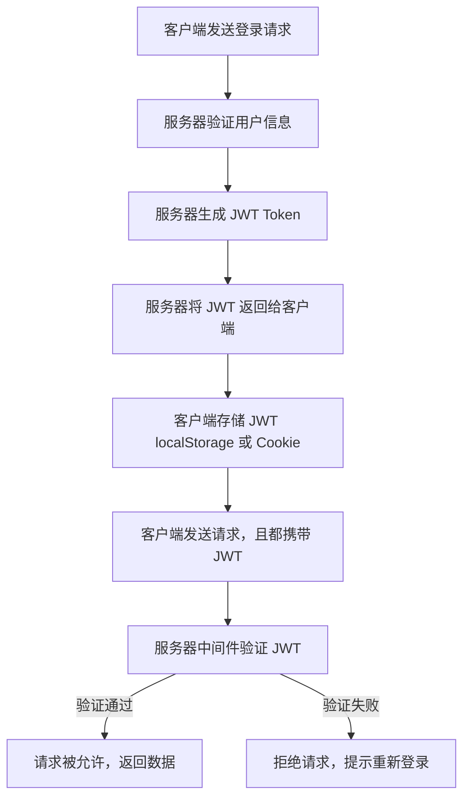

# JWT（JSON Web Token）笔记

------

- [go-jose/jwt 实际使用案例](https://bbs.itying.com/topic/686fc6004715aa0088486764)

## 一、JWT 的结构

>  JWT 由三部分组成，格式是 `header.payload.signature`，用 `.` 连接：

1. **Header（头部）**
   - 描述 Token 的元信息，如加密算法（常见 `HS256`）
   - JSON 格式，经 Base64Url 编码
2. **Payload（载荷）**
   - 主要存储用户信息和声明（Claims）
   - 包括标准声明（`iss`, `exp`, `nbf`, `sub` 等）和自定义声明
   - JSON 格式，经 Base64Url 编码
3. **Signature（签名）**
   - 由 `Base64Url(Header) + "." + Base64Url(Payload)`，用密钥和算法计算出来
   - 保证 Token 不被篡改

```shell
eyJhbGciOiJIUzI1NiIsInR5cCI6IkpXVCJ9
.
eyJ1c2VybmFtZSI6Im1vbW8iLCJleHAiOjE2ODU2MDQ4MDB9
.
sM4rZ3YkEzw5bG-qDqeYT2kqP_w9Y06UHvyrFHTjvZY
```

> **第一部分**：Header（头部，Base64Url 编码后的 JSON）
>  例：`{"alg":"HS256","typ":"JWT"}`
>
> **第二部分**：Payload（负载，Base64Url 编码后的 JSON）
>  例：`{"username":"momo","exp":1685604800}`
>
> **第三部分**：Signature（签名，用密钥和算法计算）

------

## 二、JWT 生成流程

1. 准备 Header 和 Payload
2. 使用密钥和指定算法对 Header + Payload 生成签名
3. 拼接三部分，形成完整 JWT Token

------

## 三、JWT 验证流程



> 验证 JWT 主要做以下检查：

| 验证内容     | 说明                                    |
| ------------ | --------------------------------------- |
| **签名验证** | 用密钥重新计算签名，确保数据没被篡改    |
| **过期时间** | 检查 Payload 中 `exp` 是否过期          |
| **生效时间** | 检查 `nbf`（Not Before）字段是否生效    |
| **其他字段** | 可校验 `iss`（签发者）、`aud`（受众）等 |

<br>

### 1. Session 的集群共享问题的解决

---

> 而且 token 每一次请求都会带有 payload 部分，这个有一个特别的好处，就是 payload 里面是可以存储用户的信息的，所以每一次发送请求都会主动的给予。
>
> 而 `session`必须是服务器从客户端读取。可我们为了做负载均衡的时候，往往是多台服务器，但 `session` 偏偏不共享存储空间，`传统 session 是存储在服务器端的`，客户端只是保存一个 session 的「引用（ID）」，不是数据本身。那么当请求在多台服务器切换的时候，就会导致数据的缺失。

<br>

## 四、JWT 的过期时间

- 由 Payload 里的 `exp` 字段控制，通常是 Unix 时间戳
- 需要在生成 Token 时设置，如：

```go
claims := Claims{
    Username: "momo",
    RegisteredClaims: jwt.RegisteredClaims{
        ExpiresAt: jwt.NewNumericDate(time.Now().Add(2 * time.Hour)), // 2小时后过期
        Issuer: "goBlog",
    },
}
```

<br>

## 五、JWT 在实际应用中的使用

---

1. **客户端请求登录**，服务器验证用户信息后生成 JWT 返回
2. **客户端保存 JWT**（通常存在浏览器 `localStorage` 或移动端安全存储）
3. **客户端发起请求时，带上 JWT**，一般放在 HTTP 请求头 `Authorization: Bearer <token>`
4. **服务器中间件解析并验证 JWT**，通过则放行，否则拒绝访问
5. **过期后，客户端需重新登录获取新的 Token**

<br>

## 六、常见注意点

---

- **Token 是无状态的**，服务器不保存 Token，验证靠密钥和算法
- **签名密钥务必保密**，泄露会导致 Token 被伪造
- **Token 不应存储敏感数据**，因为 Payload 可以被解码查看
- **合理设置过期时间**，平衡安全和用户体验
- **刷新机制**，过期时可设计刷新 Token 的流程

<br>

# 实现代码

---

```go
```

