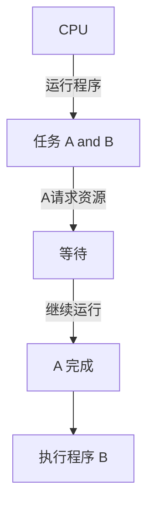
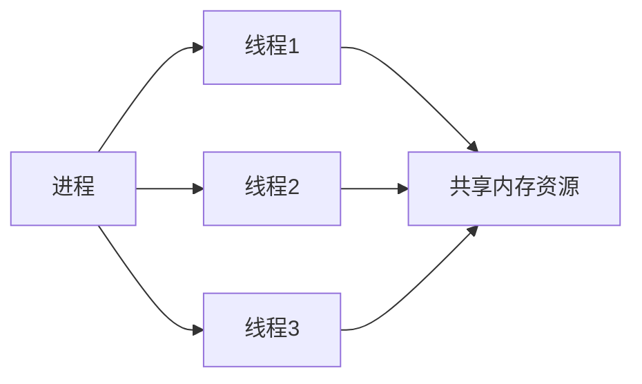
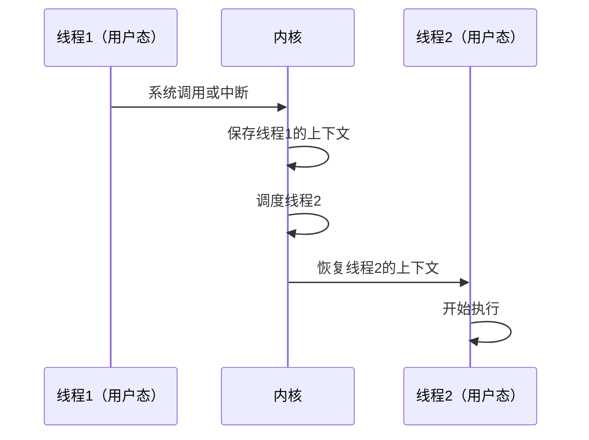
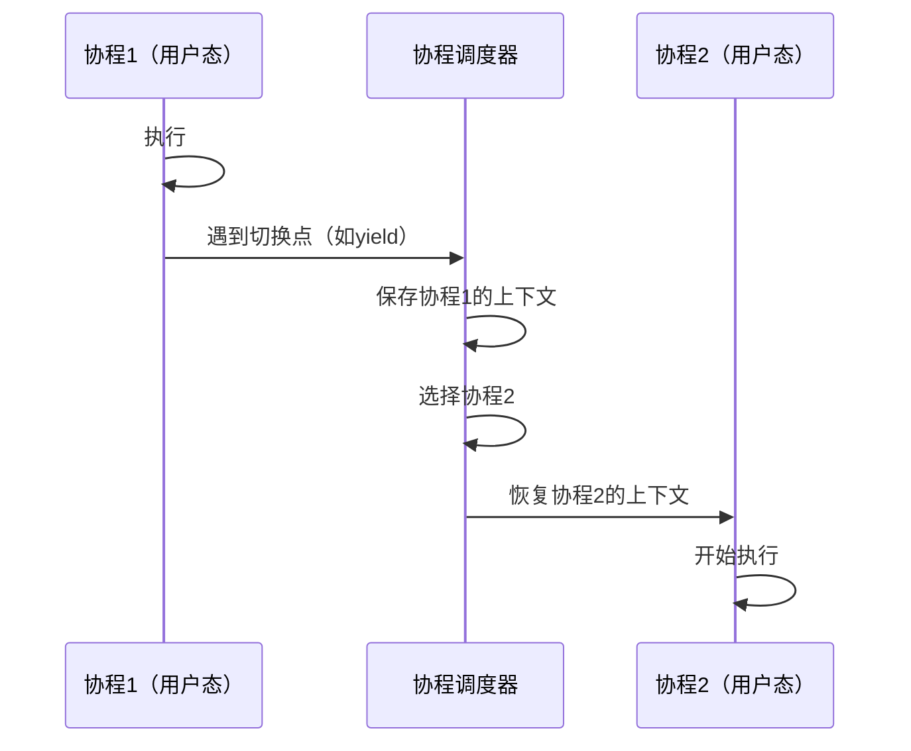
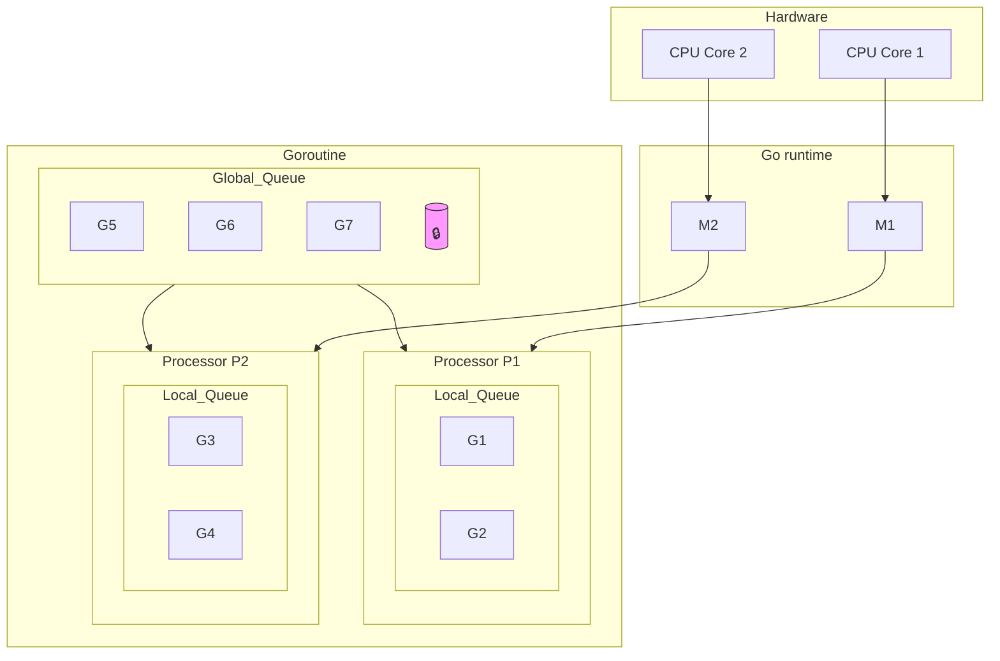

# 多任务处理学习笔记

---

##  一、多任务处理的发展历程

<br>

###  起点：为什么引入「进程」？

> 在早期计算机系统中（单道程序），计算机一次只能运行一个程序，如果遇到的阻塞就会出现下面的情况：



> 存在的问题：

- ❌ CPU 利用率低 —— 程序等待 IO 时 CPU 会闲置
- ❌ 用户体验差 —— 只能一个一个程序跑，不能“同时干活”，如果程序收到阻塞，那么后面的程序也得而等待 

---

### 1.1 初始阶段：进程（Process）

- **概念**：操作系统中最早的并发单位，每个运行的程序就是一个进程

- **特点**：
  - 独立内存空间
  - 拥有完整资源（文件句柄、地址空间、代码段等）

  

  ```mermaid
  flowchart LR
      subgraph OS[操作系统]
          P1[进程1: 播放音乐]
          P2[进程2: 下载文件]
          P3[进程3: 编辑文档]
      end
      CPU((CPU)) -->|快速切换| P1 & P2 & P3
  ```

  > 多进程解决上述问题

  ```mermaid
  graph TD
      U[CPU] -->|运行程序| A[任务 A and B]
      A -->|A请求资源| W[等待]
      W -->|继续运行| D[A 完成]
      W -->|创建进程| B[执行程序B]
      B --> C[B 完成]
  ```

  **问题**：

  - 创建成本高（复制资源）
  - 进程间通信（IPC）复杂低效

  ---

### 1.2 改进方案：线程（Thread）

- **概念**：进程内部的“执行单元”，多个线程共享进程资源
- **优势**：
  - 创建销毁比进程快
  - 多线程能并发工作



**问题**：

- 线程切换仍需操作系统参与（上下文切换、锁、内核态进出）
- 大量线程会消耗大量内存

---

## 二、用户态轻量化方案：协程（Coroutine）

### 2.1 概念简介

- 协程是“用户态调度的轻量线程”
- **不需要操作系统调度**，而是依靠调度器，所以内核态的切换相对于少一些
- 切换仅需要**保存栈+函数指针**

### 2.2 协程 vs 线程

> ### 线程的用户和内核态的切换



> ### 协程的用户和内核态的切换



| 比较项   | 线程                    | 协程                     |
| -------- | ----------------------- | ------------------------ |
| 创建成本 | 高（需要内核资源）      | 低（只分配少量栈）       |
| 切换方式 | 内核调度，需上下文切换  | 用户态切换，无需内核参与 |
| 内存占用 | 高（每个线程 1MB 左右） | 低（协程几 KB 就够）     |
| 调度控制 | 被动（OS 决定）         | 主动（程序员自己决定）   |
| 并发数   | 千级别                  | 万~百万级别              |

### 为什么协程更优？

- **调度在用户态完成，不打扰操作系统**
- **数量多，内存小，切换快**
- **Go 的 GMP 模型实现了协程调度自动化，让并发变得容易可靠**

------

## 三、Go 的协程调度模型：GMP 模型

> Go 语言的并发调度依赖 GMP 模型（**Goroutine、Machine、Processor**）

### 3.1 各角色简介

| 名称 | 全称      | 描述                                     |
| ---- | --------- | ---------------------------------------- |
| G    | Goroutine | 协程任务，由用户创建                     |
| M    | Machine   | 操作系统线程，由 Go runtime 调用         |
| P    | Processor | 调度器，用来管理可运行的 G，决定谁去执行 |

<br>

### 3.2 GMP 工作模型

---



### 3.3 调度机制

> [最好结合视频看下，光说说不清楚](https://www.bilibili.com/video/BV1VM411C73z?spm_id_from=333.788.player.switch&vd_source=b47817c1aa0db593f452034d53d4273a&p=7)

------

## 四、总结

> 多任务进化路径

