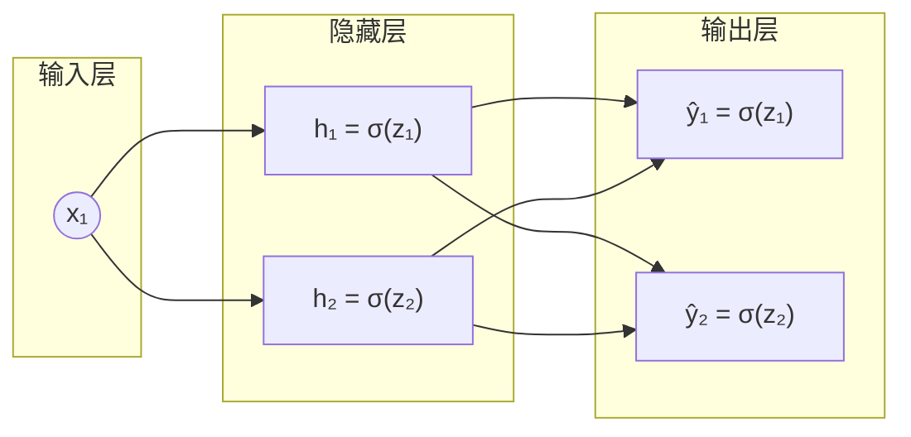

# 1. 前向传播

## 第一层

---

输入：
$$
x = \begin{bmatrix} 1 \end{bmatrix}
$$
隐藏层权重、偏置：
$$
W^{[1]} =
\begin{bmatrix}
0.2 \\
-0.3
\end{bmatrix}, \quad
b^{[1]} =
\begin{bmatrix}
0.1 \\
0.1
\end{bmatrix}
$$
计算隐藏层线性部分：
$$
z^{[1]} = W^{[1]} x + b^{[1]}
= \begin{bmatrix} 0.2 \\ -0.3 \end{bmatrix} \cdot 1
+ \begin{bmatrix} 0.1 \\ 0.1 \end{bmatrix}
= \begin{bmatrix} 0.3 \\ -0.2 \end{bmatrix}
$$
激活：
$$
a^{[1]} = \sigma(z^{[1]})
= \begin{bmatrix}
\sigma(0.3) \\
\sigma(-0.2)
\end{bmatrix}
= \begin{bmatrix}
0.5744 \\
0.4502
\end{bmatrix}
$$

 

## 第二层

---

输出层权重、偏置：
$$
W^{[2]} =
\begin{bmatrix}
0.4 & -0.5 \\
0.3 & 0.8
\end{bmatrix}, \quad
b^{[2]} =
\begin{bmatrix}
0.2 \\
-0.1
\end{bmatrix}
$$
线性部分：
$$
z^{[2]} = W^{[2]} a^{[1]} + b^{[2]}
= \begin{bmatrix}
0.4 & -0.5 \\
0.3 & 0.8
\end{bmatrix}
\begin{bmatrix} 0.5744 \\ 0.4502 \end{bmatrix}
+ \begin{bmatrix} 0.2 \\ -0.1 \end{bmatrix}
$$
先算矩阵乘法：
$$
\begin{bmatrix}
0.4 \cdot 0.5744 + (-0.5)\cdot 0.4502 \\
0.3 \cdot 0.5744 + 0.8 \cdot 0.4502
\end{bmatrix}
=
\begin{bmatrix}
0.2298 - 0.2251 \\
0.1723 + 0.3602
\end{bmatrix}
=
\begin{bmatrix}
0.0047 \\
0.5325
\end{bmatrix}
$$
加偏置：
$$
z^{[2]} =
\begin{bmatrix}
0.0047 + 0.2 \\
0.5325 - 0.1
\end{bmatrix}
=
\begin{bmatrix}
0.2047 \\
0.4325
\end{bmatrix}
$$
激活：
$$
a^{[2]} = \sigma(z^{[2]})
= \begin{bmatrix}
\sigma(0.2047) \\
\sigma(0.4325)
\end{bmatrix}
= \begin{bmatrix}
0.5510 \\
0.6065
\end{bmatrix}
$$
预测结果：
$$
\hat{y} =
\begin{bmatrix}
0.5510 \\
0.6065
\end{bmatrix}
$$
设目标输出：
$$
y = \begin{bmatrix} 1 \\ 0 \end{bmatrix}
$$
损失函数：
$$
L = \tfrac{1}{2} \left[ (1-0.5510)^2 + (0-0.6065)^2 \right]
= \tfrac{1}{2}(0.2012 + 0.3680)
= 0.2846
$$
 

# 2. 反向传播

---

## 输出层梯度

输出层误差：
$$
\delta^{[2]} = (a^{[2]} - y) \odot \sigma'(z^{[2]})
$$

- $\hat{y} = a^{[2]}$

其中 Sigmoid 导数：
$$
\sigma'(z) = \sigma(z)(1-\sigma(z))
$$
计算：
$$
\sigma'(0.2047) = 0.5510 (1 - 0.5510) = 0.2474 \\
\sigma'(0.4325) = 0.6065 (1 - 0.6065) = 0.2386
$$
误差：
$$
\delta^{[2]} =
\begin{bmatrix}
0.5510 - 1 \\
0.6065 - 0
\end{bmatrix}
\odot
\begin{bmatrix}
0.2474 \\
0.2386
\end{bmatrix}
=
\begin{bmatrix}
-0.4490 \cdot 0.2474 \\
0.6065 \cdot 0.2386
\end{bmatrix}
=
\begin{bmatrix}
-0.1110 \\
0.1447
\end{bmatrix}
$$
输出层梯度：
$$
\begin{gathered}
\frac{\partial L}{\partial W^{[2]}}=\delta^{[2]}(a^{[1]})^T=\begin{bmatrix}-0.1110\\0.1447\end{bmatrix}\begin{bmatrix}0.5744&0.4502\end{bmatrix}=\begin{bmatrix}-0.0637&-0.0500\\0.0831&0.0651\end{bmatrix}\\\frac{\partial L}{\partial b^{[2]}}=\delta^{[2]}=\begin{bmatrix}-0.1110\\0.1447\end{bmatrix}
\end{gathered}
$$

------

## 隐藏层梯度

传播误差：
$$
\delta^{[1]} = (W^{[2]})^T \delta^{[2]} \odot \sigma'(z^{[1]})
$$
先算矩阵乘法：
$$
(W^{[2]})^T \delta^{[2]}
=
\begin{bmatrix}
0.4 & 0.3 \\
-0.5 & 0.8
\end{bmatrix}^T
\begin{bmatrix}
-0.1110 \\
0.1447
\end{bmatrix}
$$
再乘上导数：
$$
\sigma'(0.3) = 0.5744 (1 - 0.5744) = 0.2445
$$
所以：
$$
\delta^{[1]} =
\begin{bmatrix}
-0.0010 \\
0.1713
\end{bmatrix}
\odot
\begin{bmatrix}
0.2445 \\
0.2475
\end{bmatrix}
=
\begin{bmatrix}
-0.00024 \\
0.0424
\end{bmatrix}
$$
梯度：
$$
\begin{aligned}\frac{\partial L}{\partial W^{[1]}}&=\delta^{[1]}x^T=\begin{bmatrix}-0.0024\\0.0424\end{bmatrix}\begin{bmatrix}1\end{bmatrix}^T=\begin{bmatrix}-0.00024\\0.0424\end{bmatrix}\\&\frac{\partial L}{\partial b^{[1]}}=\delta^{[1]}=\begin{bmatrix}-0.00024\\0.0424\end{bmatrix}\end{aligned}
$$
